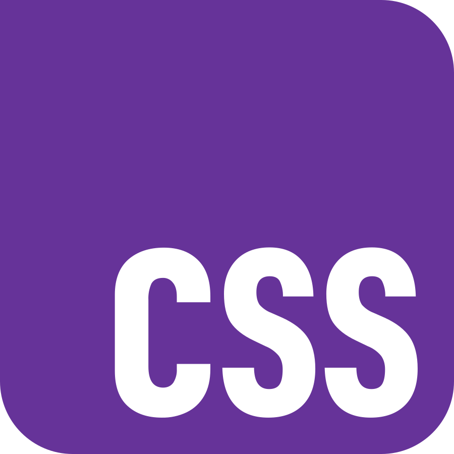

I'm a **web developer** based in France. I worked for 15 years as a biologist before discovering the joy of coding.

## Main Languages and Tools

    
    
    
    
    
    
    
    
    
    
    
    
    

